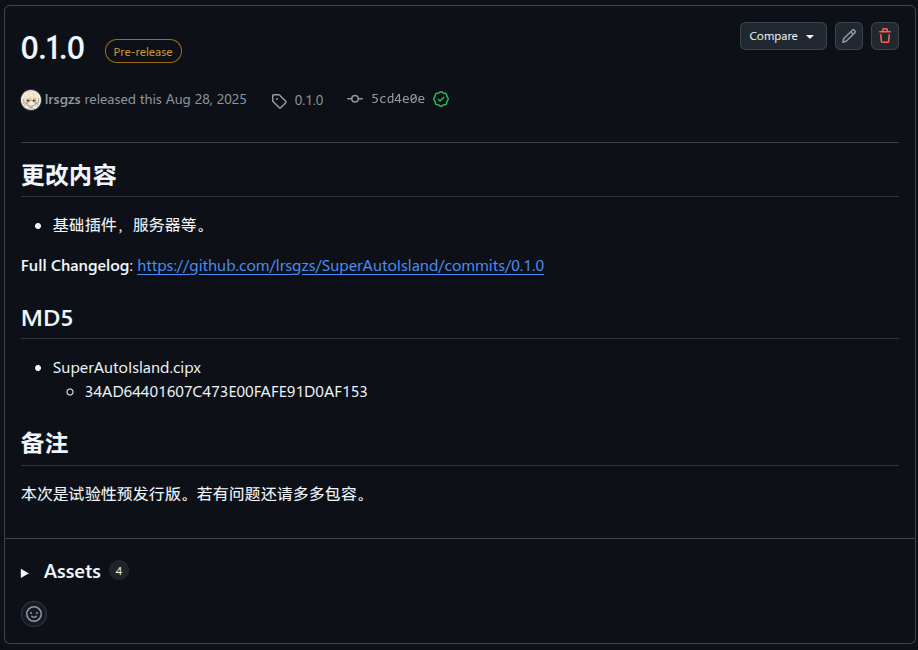
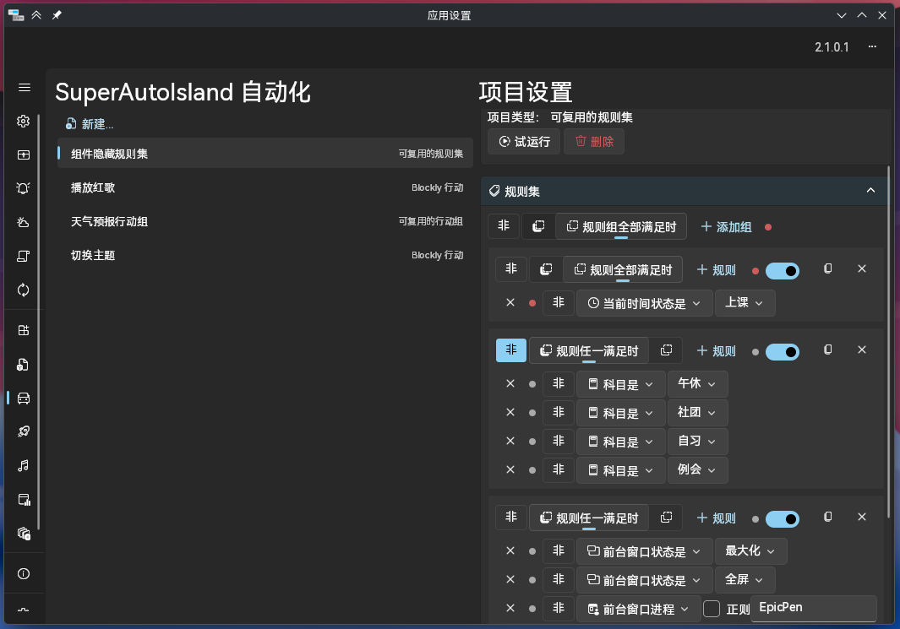
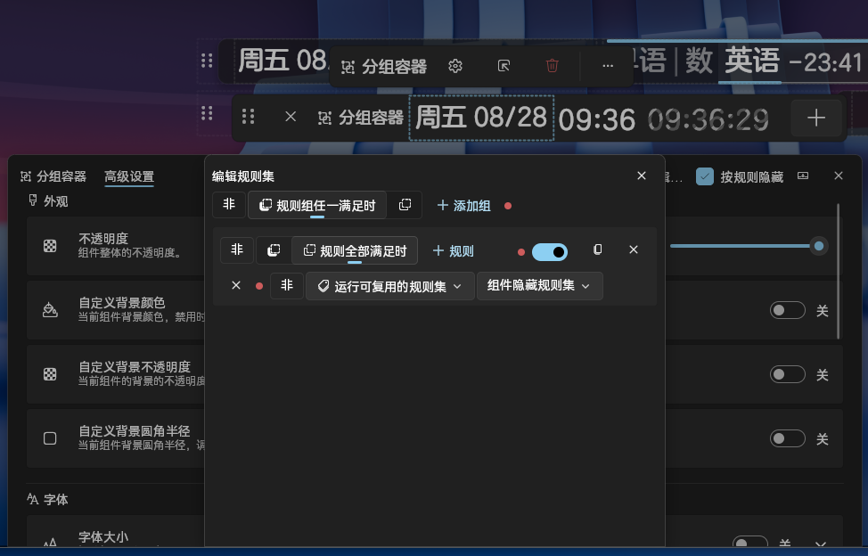
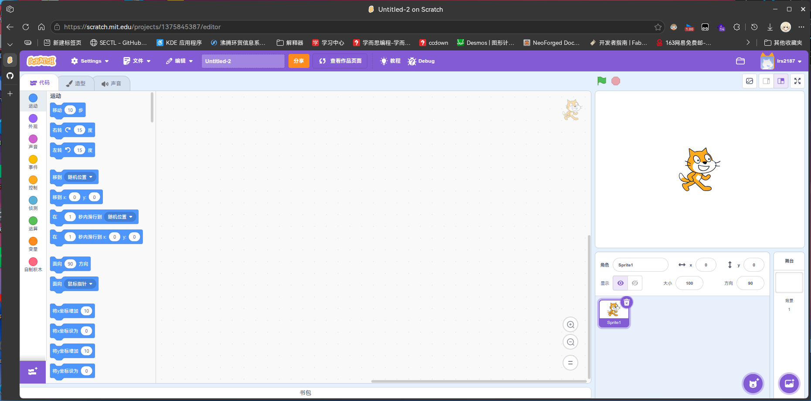
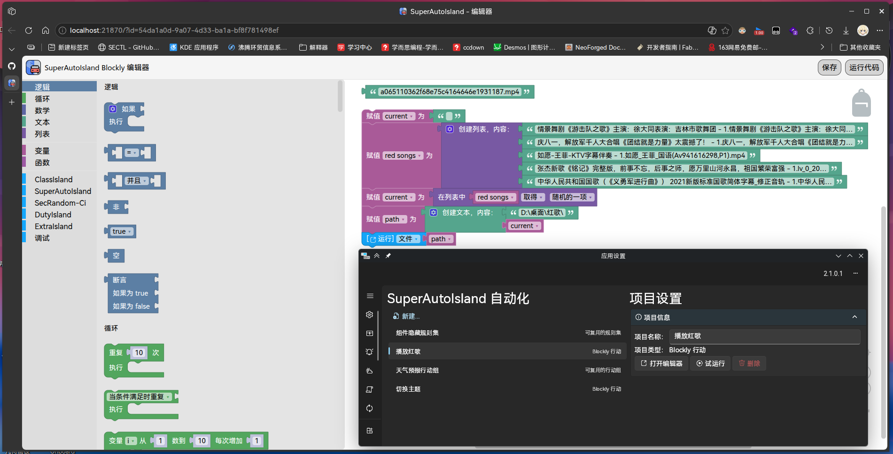
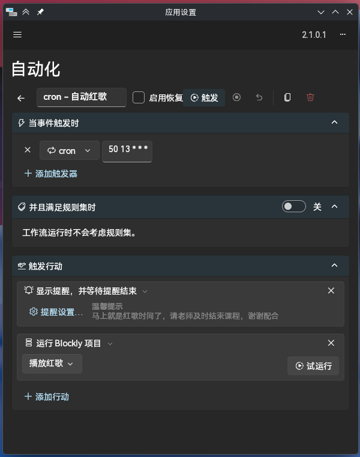
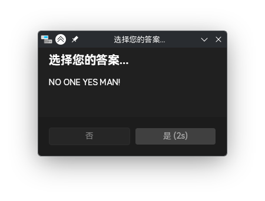

<!-- TITLE: 把自动化变成搭积木 —— SuperAutoIsland -->
<!-- AUTHOR: lrs2187 -->

# 把自动化变成搭积木 —— SuperAutoIsland

编者：lrs2187

> 这个插件说实话挺好玩的，自动化能上一个台阶。

## 前言

说来距离 SuperAutoIsland 0.1.0 发布已经过去一年了呢。
这一年里，SuperAutoIsland 一直在稳步发展、前进。

感谢各位开发者、用户见证了 SuperAutoIsland 的发展。

不过，SAI 至今还没有一份用户文档。
就在这一周年的日子，将这篇插件介绍作为第一篇文档吧。

## Chapter 1 · 安装

首先前往 ClassIsland 插件市场，找到 SuperAutoIsland，点击安装即可。

得益于 0.1.4.1 更换了 JS 运行库，插件体积大幅缩小。
由原来的 80MB (解压后 200MB+) 缩小到了 3MB (解压后 5MB)。

~~毕竟塞 7 个不同平台的 V8 引擎还是太大了~~

## Chapter 2 · 功能简介

SuperAutoIsland 主要有以下三个板块：

- **复用：** 复用已有的 ClassIsland 自动化元素。
  - 可复用的行动组：将常用行动打包成组，多处都可调用。
  - 可复用的规则集：把复杂的规则集保存下来，随时复用。
- **对话框**
  - YesNo 对话框
  - 文本输入对话框（暂时有问题，等待下一个版本修复）
- **Blockly**
  - Blockly 行动

其中最复杂的、最特色的功能就是「Blockly 行动」。

不过「可复用的规则集」应对规则集很复杂的情况时也很有用。不信？

每个组件都配置这么一套规则，手得废掉。
用「可复用的规则集」就可以...

轻松多了。

## Chapter 3 · Blockly

说到 Blockly，大家第一个想到的是不是 Scratch？

对的。scratch-blocks 就是基于 Blockly 修改出来的。

那 SuperAutoIsland 的 Blockly 可以干什么？

如你所见。这样的自动化只用 ClassIsland 是不容易实现的。
SAI 通过 Blockly 生成 JS 代码，再在 ClassIsland 运行。
因此，「Blockly 行动」的自由度是远大于原生自动化的。

### 基本积木

「逻辑」「循环」「数学」「文本」「列表」「变量」「函数」
这七个分类直接来自 Blockly，都是编程里最常用的积木块。

哈？还需要讲吗？

后续在 1.0.0.0 会添加「日期与时间」「字典」两个分类。

### 附加积木

除了以上七个分类，其余分类均为 SuperAutoIsland 和其他插件添加的。

「调试」分类主要负责控制台输出。可在开发者工具或 SAI 的日志查看。

其他的插件分类均由「规则」「行动」「数据」三个元素组成。
后续在 ClassIsland 2.2 的版本中，会优化插件分类注册自由度。

SAI 在 ClassIsland 2.2 版本会添加「档案相关操作」的积木。
这些积木足以让你从档案获取信息，实现更灵活的自动化。

## Chapter 4 · 其他功能

### 可复用的行动组 & 可复用的规则集

允许你在各个地方调用已经设置好的一批行动、或者一组规则集。

对于将「复杂规则」或「多处使用的行动」抽象化很有用。

### YesNo 对话框

这是一个规则，所以它具有较强的适用性。

> ⚠️ 注意：
>
> **不建议直接在组件隐藏规则集中直接添加这个规则。**
> 否则每次窗口变化都会弹出一次弹窗，可能会影响教学安全。

如果需要用本对话框决定是否展示指定组件，
请通过 ExtraIsland 的「标志」和 Blockly 行动等途径完成。

这个对话框支持设置标题、消息、按钮文本、是否置顶、是否启用倒计时、是否仅显示一次，
自定义度算是很高的了。

效果：

### 动态文本

这个很简单的，只是 ExtraIsland「标志」功能的类似物。
仅仅是能在主界面显示设置的动态文本而已。

在 ClassIsland 2.2 中，ExtraIsland 会添加标志显示组件。
届时，动态文本的使命就会结束。不过不会删掉，保留兼容性。

## Chapter 5 · 联动

如果你喜欢的插件有自动化元素，Blockly 编辑器却没有这个元素，
那说明它还没主动适配 SAI。

不过有两条路可以走：

1. 使用「可复用的行动组」或「可复用的规则集」：

    这两个功能可以作为中转，在 Blockly 桥接到目标插件的自动化元素。

    缺点：不能动态构造参数，传递给自动化元素。

2. 寻求插件开发者适配：

    相较于方案一，这个方案更加灵活，不过也更加耗时。
    开发者适配后，可以直接在 Blockly 编辑器使用相应积木。

    如果你是开发者，欢迎参考 SAI 的接入文档。

## 结语

嗯，基本上把 SuperAutoIsland 的功能说了一遍。
希望这篇文章能成为合格的文档。

GitHub 仓库：[lrsgzs/SuperAutoIsland](https://github.com/lrsgzs/SuperAutoIsland)

> 今天是 2026/08/28。
> 就在一年前的 2025/08/28，我按下发布按钮时，虽然不知前途有多光明，但我知道...
> 
> **SuperAutoIsland 会是我最值得拿出来一说的 ClassIsland 插件。**

SuperAutoIsland 1周年快乐。愿 SAI 能够继续前进，成就更好的自动化！

等 ClassIsland 2.2 正式版（或者至少是公众预览版）出来后，
我会尽快发布 SuperAutoIsland 1.0.0.0，不辜负大家的期望。

再次感谢各位开发者、用户见证了 SuperAutoIsland 的发展。

愿你终能达成你所心向之事。
_因为，我们本就是一个人啊..._

有任何想法或问题，欢迎在评论区留言，或者到 GitHub 仓库提 Issue。

### 鸣谢

本次文章封面由 LiPolymer 绘制。字体使用 MiSans、阿里妈妈数黑体。

> **CC BY-SA**
>
> 本文以 CC BY-SA 协议发布。
> 该协议需要署名，允许商业使用和演绎，但要求演绎作品使用相同许可。

---

