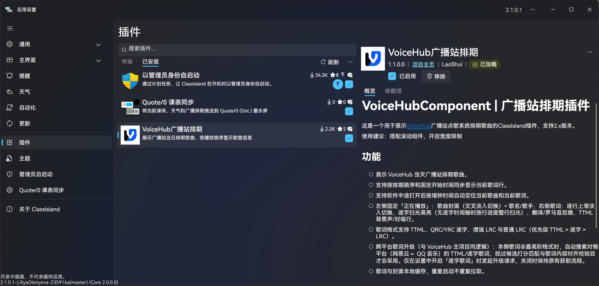
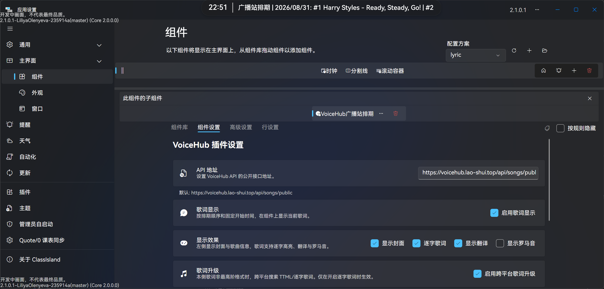

<!-- TITLE: 把广播站搬上班级屏幕 —— VoiceHub广播站排期插件 -->
<!-- AUTHOR: LaoShui -->

> 轻松把点歌系统 VoiceHub 的排期、歌曲的歌词搬上 ClassIsland 主界面

## 前言

VoiceHub 跑起来之后，点歌和排期是可以正常运转了。
但一直以来，有个问题困扰着大家：
**歌曲播放到哪一首了，只能靠耳朵猜。**


排期表有了，但「现在正在播什么」这件事，
在教室的大屏上一直是空白的。

于是就有了这个插件——**VoiceHub 广播站排期**。
这个插件支持 ClassIsland 2.x，可以将当天的排期、
甚至正在唱的那句歌词，直接显示在班级大屏上。

## Chapter 1 · 安装

前往 ClassIsland 插件市场，搜索「VoiceHub广播站排期」，点击安装即可。



使用时**建议搭配滚动组件使用，并开启宽度限制。**
毕竟一整天的排期全列出来，一行是放不下的。

> 如果你的学校部署了自己的 VoiceHub 实例，
> 安装完成后记得先配置 API 地址（见 Chapter 4）。

## Chapter 2 · 排期一览

默认模式下，组件会展示当天全部排期歌曲：



```plaintext
广播站排期 | 2026-08-28: #1 歌手 - 歌曲 - 点歌人 | #2 ...
```

每首歌按排期顺序编号，歌手、曲名、点歌人一目了然。

如果今天没有排期，组件会自动切换到最近的一次未来排期，
并在行首显示对应日期，不会出现空窗。

## Chapter 3 · 实时歌词

这是整个插件的重头戏。

在设置里开启「启用歌词显示」后，组件不再只是罗列歌单，
而是跟着广播的进度，实时显示**正在播放的那一句歌词**：

<video src="./assets/lyric-display.mp4"></video>

```
♪ #3 歌手 - 歌曲 | 正在唱的这句歌词 / 翻译
```

你可能会问：插件又不知道广播几点开始、播到哪了，怎么对得上？

其实很简单，插件有**墙钟同步**功能：

插件根据「当天第一首歌的固定开始时间」加上每首歌的时长，
在本地推算出每一首歌、每一句歌词应该出现的时间点。
于是——

- 广播进行到第几首，屏幕就显示第几首；
- 哪怕 ClassIsland 中途才打开，也能立刻定位到当前歌曲和歌词；
- 歌词带翻译时，原文和译文会一起显示。

> 歌词进度完全由本地时钟推算，不依赖任何播放器的状态同步。
> 只要广播站按排期顺序、准点开播，歌词就能对上。
>
> 歌词对不上？可能是广播站提前开播了 😂

~~像玄学对吧，其实只是把「几点开播 + 每首歌多长」（大模拟）加明白了。~~

### 歌词是怎么来的？

为了让进度推算足够准，插件在背后做了不少事：

- **多格式歌词解析**：
  LRC、逐字歌词、QQ 音乐的 QRC、TTML 等各种常见歌词格式都能解析，翻译行也能自动对齐。
- **多源歌曲时长**：
  优先从 VoiceHub 和音乐平台接口获取真实时长；
  拿不到就降级，甚至直接读取音频的 MP3 来推算时长。
  使用估算时长的歌曲会标注「（时长估算）」。
- **每日歌词缓存**：
  歌词和时长按天缓存，排期或配置变化时自动失效，
  不会每次都把所有歌都重新请求一遍。
- **自动刷新与容错**：
  组件每小时自动刷新一次，
  网络失败自动重试并进入冷却，不会疯狂请求接口。

## Chapter 4 · 配置

在 ClassIsland 的组件中找到「VoiceHub广播站排期」，
添加到主界面，然后设置：

- **API 地址**：
  指向你的 VoiceHub 实例的公开排期接口。
- **启用歌词显示**：
  开启后进入 Chapter 3 所述的实时歌词模式。
- **固定开始时间**：
  当天第一首歌开始播放的时间，如 `12:20`。
  这是歌词同步的锚点，请按广播站实际开播时间填写。
- **网易云音乐 Cookie**（可选）：
  填写后获取网易云歌曲的播放地址和时长会更准确，
  尤其对需要会员权限的歌曲。
- **调试排期日期**：
  仅用于测试，可以让组件按指定日期加载排期。

> ⚠️ 注意：
> 
> API 地址默认指向作者自己学校的实例，**请改成你们学校自己实例的地址**。

设置页还提供了「保存配置」「刷新组件」「重新获取歌词」「测试连接」「重置为默认」按钮。
改完配置之后可以点一下「测试连接」，验证接口是否可达。

## 结语

VoiceHub 让点歌和排期有了着落，
而这个插件让「播到哪了」有了答案。

如果你的学校也在用广播站点歌，欢迎试试这套组合：

- VoiceHub 广播站点歌系统：
  https://github.com/laoshuikaixue/VoiceHub
- VoiceHubComponent（ClassIsland 插件）：
  https://github.com/laoshuikaixue/VoiceHubComponent

有任何想法或问题，欢迎在评论区留言，或者到 GitHub 仓库提 Issue，同时也欢迎加入我们的用户群。

> **CC BY-SA**
>
> 本文以 CC BY-SA 协议发布。
> 该协议需要署名，允许商业使用和演绎，但要求演绎作品使用相同许可。
